# Ebanking Backend
<hr>

<br>

Pour lancer le serveur keycloak on utilise cette commande:

```
kc.bat start-dev
```
<br>

Par défaut le serveur keycloak se trouve dans le port :8080 ,

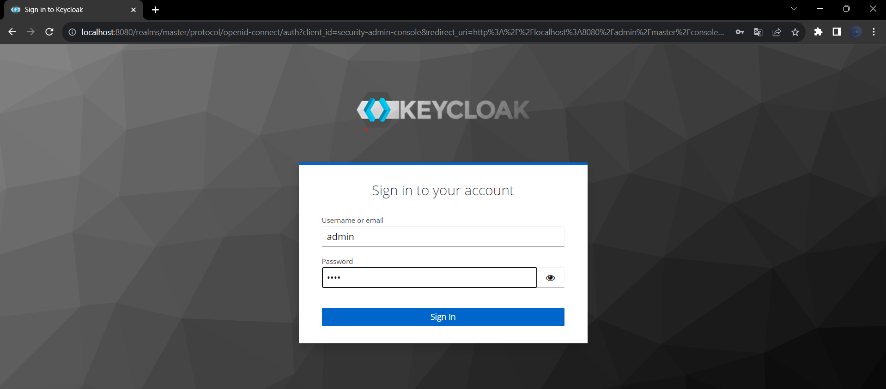

<br>

Premierement la création d'un realm :

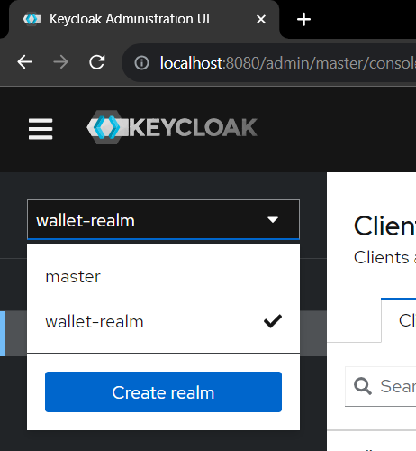

<br>
Pour la création des clients:

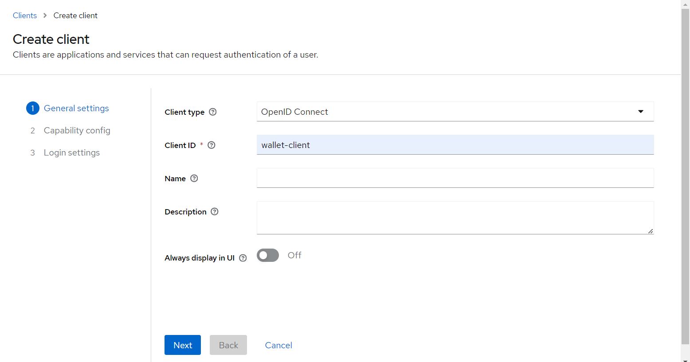

<br>

On peut créer des clients sans "Client authentication" et pour s'authentifier on utilise soit le mot de passe, soit refresh token

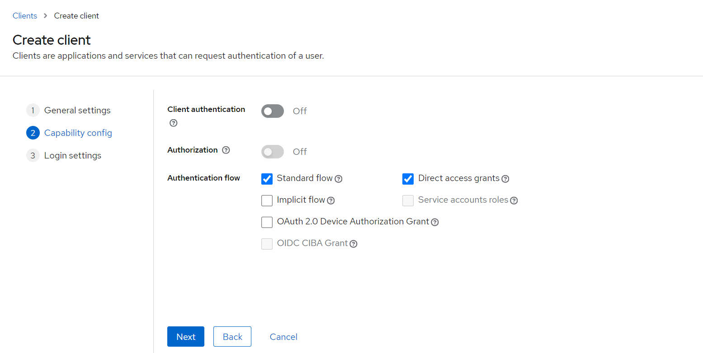

<br>

Si on active "Client authentication", on peut s'authentifier avec le id du client "wallet_client" et le clé secret

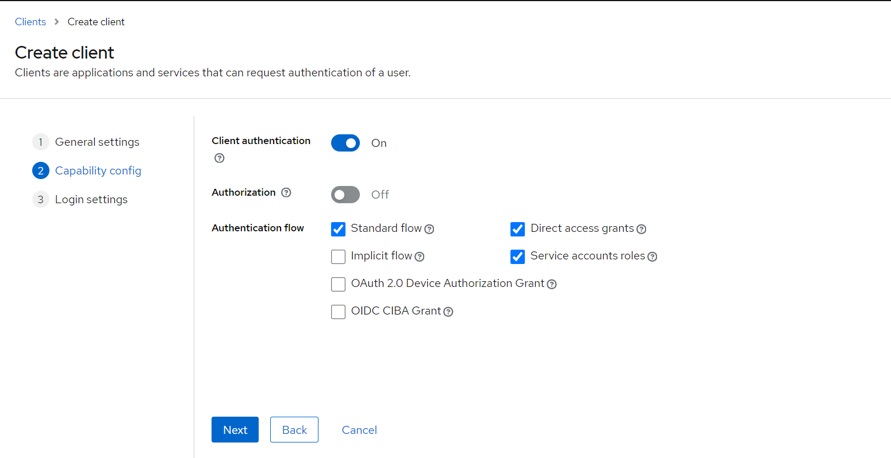
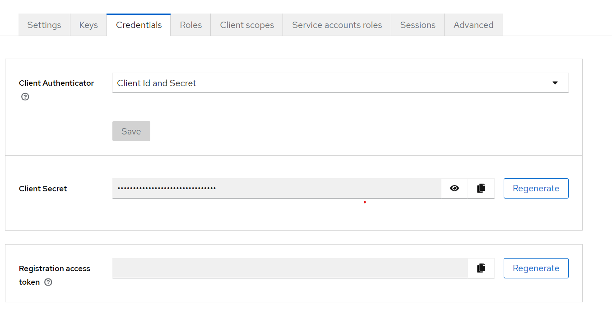

<br>

Apres on doit définir les routes :

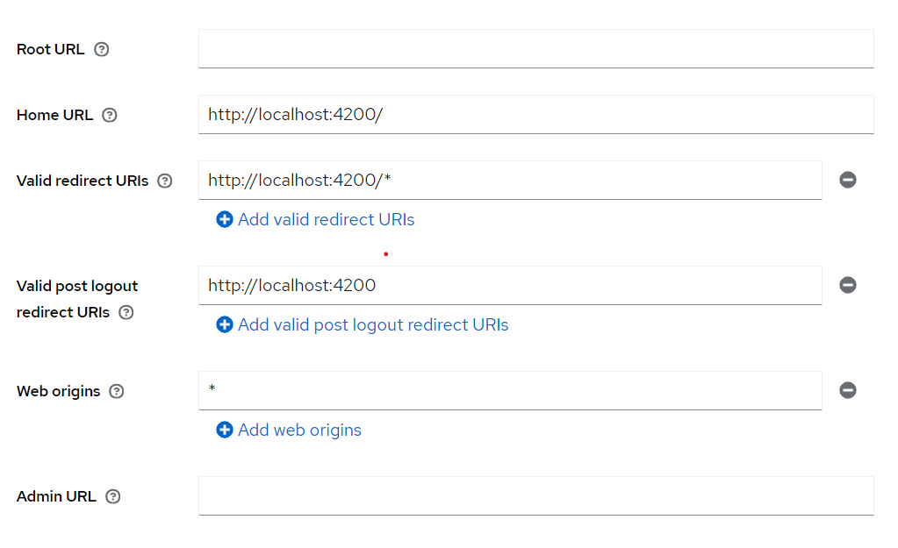

<br>
Apres la configuration du keycloak, on teste l'authentification:

<br>

Authentification par mot de passe :

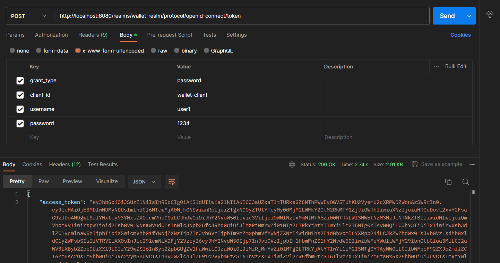

<br>

Authentification par refresh token :

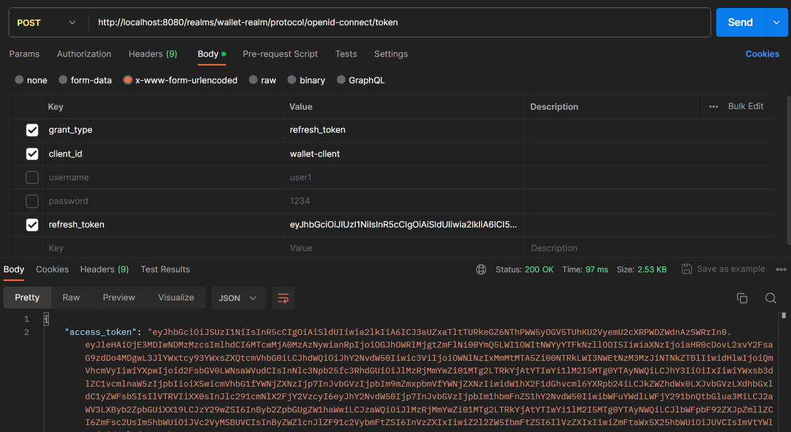

<br>

Authentification par secretKey :

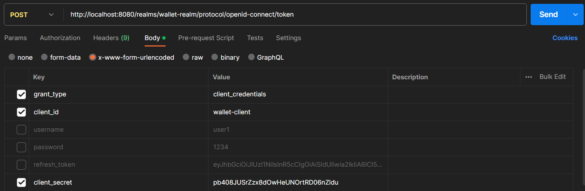

<br>

Puis on configure le backend avec keycloak:

<br>

Les dependences:

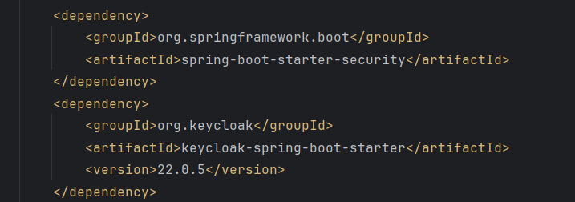

<br>

La configuration du propriétés:

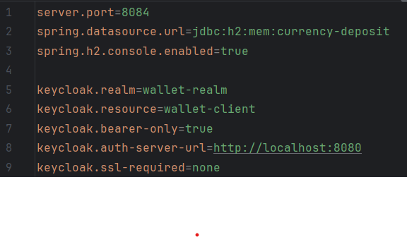

<br>

Les classes de sécurité utilisées:

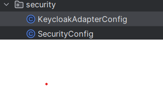

<br>

KeycloakAdapterConfig class:

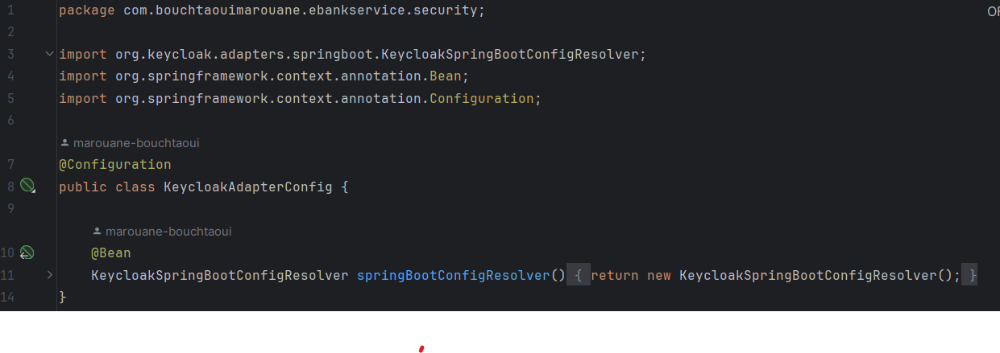

<br>

SecurityConfig class:

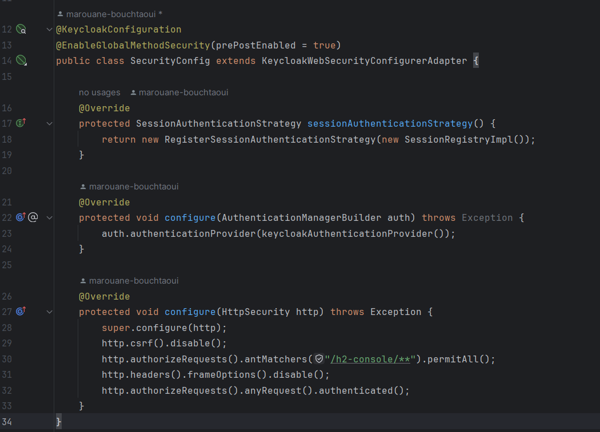

<br>

Pour keycloakRestTemplate:

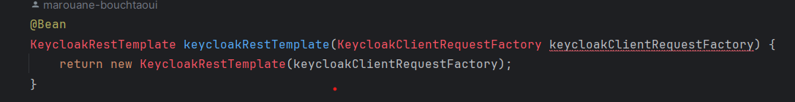

<br>

Sécurisation des méthodes :

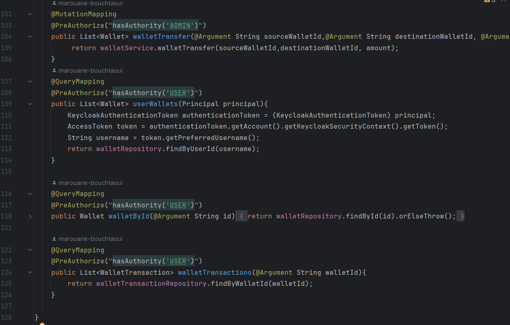